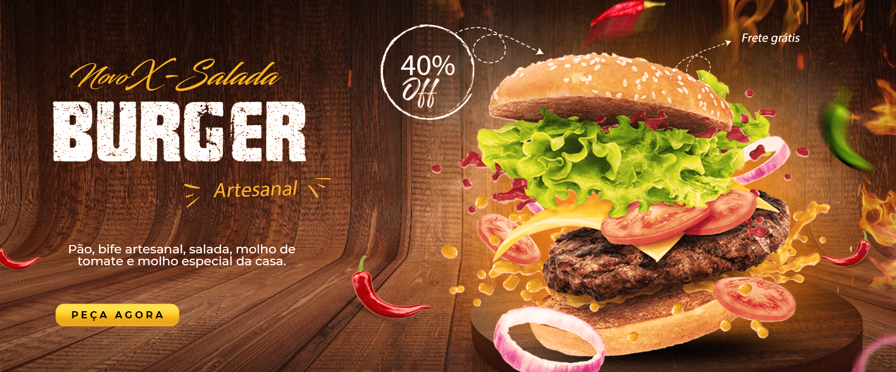

# Programação de Funcionalidades

### RF-001	Gerenciar cardápios


Para atender ao requisito gerenciar cardapios foram criadas seções separadas contemplando o carrossel, a seção de lanches, e a seção de bebidas.

```  
<section class="carrossel  ">
        <div class="slider">
            <div class="slides">
                <!--Radio-->
                <input type="radio" name="radio-btn" id="radio1">
                <input type="radio" name="radio-btn" id="radio2">
                <input type="radio" name="radio-btn" id="radio3">
                <!--Radio-->

                <!--Slide imagens-->
                <div class="slide first">
                    
                </div>
                <div class="slide">
                    
                </div>
                <div class="slide">
                    
                </div>
                <!--Slide imagens-->

                <!--navigation-->
                <div class="navigation-auto">
                    <div class="auto-btn1"></div>
                    <div class="auto-btn2"></div>
                    <div class="auto-btn3"></div>
                </div>
                <!--navigation-->
            </div>

            <div class="manual-navigation">
                <label for="radio1" class="manual-btn"></label>
                <label for="radio2" class="manual-btn"></label>
                <label for="radio3" class="manual-btn"></label>

            </div>
        </div>

    </section>
```

### RF-002	Gerenciar promoções/produto


Para atender ao requisito gerenciar promoções/produto foi criada uma seção onde é feito o cadastro da promoção/produto e outra seção onde as informações cadastradas aparecem.

```
 <section class="adicionar">
        <div class="inputs">
            <label for="nome">Nome</label>
            <input type="name" id="name" name="name" placeholder="Nome da promoção">
            <label for="desc">Descrição</label>
            <input type="text" id="desc" name="desc" placeholder="Descrição da promoção">
            <label for="categoria">Categoria</label>
            <select name="categoria" id="categoria">
                <option value="promocao">Promoções</option>
            </select>
            <label for="preco">Preço</label>
            <input type="text" id="preco" name="preco" placeholder="Preço da Promoção">
        </div>
        <div class="thumb">
            <label for="imagem"></label>
            <input type="file" id="imagem" name="imagem" placeholder="vazio" accept="image/*" onchange="previewImage(event)">
            
        </div>
        
        
        <button onclick="cadastrarPromocao()">Adicionar</button>
    </section>
```

### RF-003	Gerenciar pedidos


Para atender ao requisito gerenciar pedidos foi criado uma tabela que receberá as informações geradas após a finalização da compra.

```
<section class="pedidos">
    <h3>Gerenciamento de vendas</h3>
    <div class="content">
        <table id="tabelaPedidos" class="rTable">
            <thead>
                <tr>
                    <th> Numero do pedido </th>
                    <th> Nome </th>
                    <th>E-mail </th>
                    <th>Telefone </th>
                    <th>Endereço </th>
                    <th>Forma de pagamento </th>
                    <th>Pedido</th>
                    <th> Valor </th>
                    <th> Excluir</th>
                </tr>
            </thead>
            
        </table>
    </div>
    </section>
```

### RF-004	Pesquisar por itens no cardápio


Para atender ao requisito pesquisar por itens no cardápio foi criado um campo no navbar utlizando uma div.

```
<div class="pesquisa">
            <input type="text" id="pesquisar" name="pesquisar" placeholder="Pesquisar">
            <ion-icon name="search-outline"></ion-icon>
        </div>
```

### RF-005	Gerenciar formas de pagamento (PIX, cartão, dinheiro)


Para atender ao requisito gerenciar formas de pagamento foi criado um formulário para preenchimento das informações.

```
<section class="secPagamento">
        <div class="conteudoPagamento">
                <form name="formPagamento" method="dialog">
                    <label for="Nome">Nome</label> <br>
                    <input type="text" name="nome" id="nome" required> <br>
                    <label for="E-mail">E-mail</label> <br>
                    <input type="email" name="email" id="email" required> <br>
                    <label for="Telefone">Telefone</label> <br>    
                    <input type="text" name="telefone" id="telefone" required> <br>
                    <label for="DataNascimento">Data de Nascimento</label> <br> 
                    <input type="date" name="dtaNascimento" id="dtaNascimento" required> <br>
                    <label for="Cep">CEP</label><br>
                    <input type="text" name="cep" id="cep" onblur="consultaCEP(this.value);" required> <br>
                    <label for="Endereco">Endereço</label> <br>
                    <input type="text" name="logradouro" id="logradouro" placeholder="Endereço" required>
                    <input type="text" name="numero" id="numero" placeholder="Número" required>
                    <input type="text" name="bairro" id="bairro" placeholder="Bairro" required>
                    <input type="text" name="cidade" id="cidade" placeholder="Cidade" required> <br>
                    <label for="FormaPagamento">Forma de Pagamento</label> <br>
                    <fieldset>
                        <input type="radio" name="formaPgm" value="dinheiro" checked> Dinheiro (Na Entrega) <br>
                        <input type="radio" name="formaPgm" value="pix"> PIX <br>
                        <input type="radio" name="formaPgm" value="catao"> Cartão de Credito ou Débito (Na Entrega) <br>
                        <input type="radio" name="formaPgm" value="refeicao"> Cartão Refeição (Na Entrega) <br>
                    </fieldset> <br>        
                    <button onclick="ConfirmarPagamento()" class="btn"><ion-icon name="checkmark-circle-outline"></ion-icon>&nbsp Confirmar</button>
                </form>
        </div>
    </section>
```

### RF-006	Gerenciar cupons de desconto


Para atender ao requisito gerenciar cupons de desconto foi criada uma seção onde é feito o cadastro do cupom e outra seção onde as informações cadastradas aparecem.

```
<section class="adicionar">
        <div class="inputs">
            <label for="nome">Código</label>
            <input type="text" id="name" name="name" placeholder="Código do Cupom">
            <label for="preco">Desconto</label>
            <input type="number" id="preco" name="preco" placeholder="Desconto em %">
        </div>
        <button>Adicionar cupom</button>
    </section>
```

### RF-007	Visualização de endereço com mapa


Para atender ao requisito visualização de endereço com mapa foi utilizada a API do Google Maps.

```
<section class="cardapio">
        <div class="categoria ">
            <h1 class="">Nossa Localização</h1>
            <p> Endereço: Avenida das Américas, 4666.
                <p> 22640-102.
                    <p> Barra da Tijuca, Rio de janeiro
            </p>
            <div class="produtos">                     
                               
                <div class="mapBox">
                    <iframe src="https://www.google.com/maps/embed?pb=!1m18!1m12!1m3!1d3672.710840484617!2d-43.36070172481268!3d-22.99765827919125!2m3!1f0!2f0!3f0!3m2!1i1024!2i768!4f13.1!3m3!1m2!1s0x9bda484e87aa9d%3A0xc7d7329425cbf250!2sAv.%20das%20Am%C3%A9ricas%2C%204666%20-%20Barra%20da%20Tijuca%2C%20Rio%20de%20Janeiro%20-%20RJ%2C%2022640-102!5e0!3m2!1sen!2sbr!4v1685192717456!5m2!1sen!2sbr" width="600" height="450" style="border:0;" allowfullscreen="" loading="lazy" referrerpolicy="no-referrer-when-downgrade"></iframe>  
                </div>
            </div>
        </div>       
       
    </section>
```

### RF-008	Tradução da página para inglês


Para atender ao requisito Tradução da página para inglês foi criado um campo no navbar utlizando div e span para fazer a caixa de seleção.

```
<div class="traducao">
        <span onclick="traducao()" id="traducao">Inglês<ion-icon name="caret-down-outline"></ion-icon></span>
        <span class="traducao-op" onclick="traducao2()" id="traducao2">Português</span>
</div>
```

### RF-009	Cadastrar e gerenciar feedback dos clientes


Para atender ao requisito cadastrar e gerenciar feedback dos clientes foi criado um formulário com campos com opções de avaliação preenchidas onde o cliente escolhe a melhor opção.

```
<div style="padding-bottom: 18px; line-height: 75%;">
            Qual é a sua impressão geral sobre o restaurante?<br>&nbsp;<br>
            <select class="feedback-select" id="data_4" name="Nota_restaurante">
                <option class="feedback-option"style="background-color: LawnGreen;">Excelente</option>
                <option class="feedback-option"style="background-color: YellowGreen;">Muito Bom</option>
                <option class="feedback-option"style="background-color: ForestGreen;">Bom</option>
                <option class="feedback-option"style="background-color: orange;">Razoável</option>
                <option class="feedback-option"style="background-color: FireBrick;">Ruim</option>
            </select>
        </div>
```

### RF-010	Gerenciar dados dos usuários


Para atender ao requisito gerenciar dados dos usuários foi criado campos utlizando div's, labels e inputs.

```
<section class="login">
        <div class="conteudo">
            <h1>Login<br>Proprietário</h1>
            <form action="">
            <label for="Email">Email</label>
            <input type="email" placeholder="Seu Email">
            <label for="password">Senha</label>
            <input type="password" placeholder="Sua Senha">
            <button><ion-icon name="key-outline"></ion-icon>Entrar</button>
            </form>

        </div>
    </section>
```
