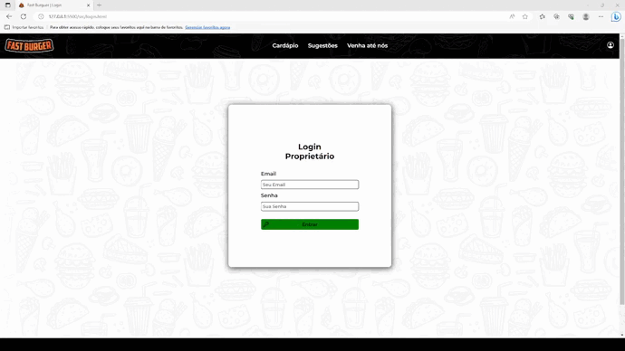

# Plano de Testes de Software

## Resultados Esperados

| Nº Teste | Página | Cenário de teste |
|-----------|-----------------------------------------|----|
|TF-001| Cardápio | A página deverá somente estar preenchida com o navbar, os nomes das seções de produtos e o rodapé. |
|TF-002| Cardápio | Ao clicar no ícone de login que fica localizado no lado direito do navbar a página de login deverá ser carregada. |
|TF-003| Login | Na tela os dados de login do administrador deverão ser preenchidos e ao clicar em "Entrar" ou apertar a tecla Enter a página de cadastro de produtos deverá ser carregada. |
|TF-004| Cadastro-produtos | Nesta tela o produto pode ser cadastrado preenchendo os campos e inserindo uma imagem do produto. Ao finalizar o cadastro o produto deverá aparecer logo abaixo na área de produtos cadastrados e tambem na pagina index. |
|TF-005| Cadastro-produtos | Ao clicar no botão "Remover" o produto  cadastrado será excluído tanto nesta página como na index. | 
|TF-006| Cadastro-promoções | A promoção pode ser cadastrado preenchendo os campos e inserindo uma imagem. Ao finalizar o cadastro deverá o card da promoção aparecer logo abaixo na área de promoções cadastrados e também na página index. |
|TF-007| Cardápio | Com produtos e promoções cadastradas as imagens das promoções deverá aparecer no carrossel, e os cards dos produtos e promoções deverão aparecer em suas respectivas seções.  |
|TF-008| Cardápio | Ao clicar em adicionar no produto(s) desejado o mesmo deverá ser enviado para o carrinho de compras. Cumprindo assim os Requisitos RF-001 (Gerenciar cardápios) e RF-002 (Gerenciar promoções). |
|TF-009| Cardápio | Na barra de pesquisa deverá ser entrado a informação ser procurada, e assim será filtrado a seção onde encontra a informação desejada. Cumprindo o Requisito RF-004 (Pesquisar itens no cardápio). |
|TF-010| Carrinho de Compras | Nesta página o usuário acessará os produtos escolhidos no cardárpio e o valor total.|
|TF-011| Carrinho de Compras | O cliente poderá alterar a quantidade de itens e excluir itens do carrinho.|
|TF-012| Carrinho de Compras | O selecionar todos os itens o cliente pode aplicar ou não um cupom de desconto. |
|TF-013| Página de Pagamento | Ao carregar esta página, serão exibidos os campos de informações para que o usuário forneça seus dados para a realização do pedido. |  |
|TF-014| Página de Pagamento | O usuário que esquecer algum dado aparecerá uma mensagem de alerta solicitando o preenchimento. |
|TF-015| Página de Pagamento|Ao fornecer o seu CEP, os outros campos referente ao endereço serão preenchidos automaticamente.|
|TF-016| Pedidos| Ao acessar esta página o usuário terá acesso aos pedidos realizado pelos clientes, estes dados foram originados pela página de pagamento. |
|TF-017| Pedidos |Conforme os pedidos forem entregues, o funcionário da hamburgueria poderá excluir os pedidos, ao clicar no botão de "excluir", excluindo os pedidos da tabela e do Localstorage.|
|TF-018| Gerenciar cupom| Será adicionado no LocalStorage os cupons criado pelo administrador do site.|
|TF-019| Gerenciar cupom| Sinalização em cores vermelhas, em caso de erro na digitação do código do cupom.|
|TF-020| Gerenciar cupom| Botão de remoção do cupom, excluindo os descontos tanto da página e do LocalStorage.|
|TF-021| Gerenciar Cupom| Conforme o usuário adiciona o cupom corretamente, a página será atualizada e o cupom implementado.| 
|TF-022| Sugestões | Ao carregar esta página, o usuárior poderá preencher os campos sobre a sua experiência como cliente da hamburgueria FastBurguer. |
|TF-023| Sugestões |Após o preenchimento pelo cliente, os dados serão armazenado no localstorage. |
|TF-024| Sugestões | Os dados serão exibidos numa página do administrador da hamburgueria.|
|TF-025| Tradução | Na tela inicial do site, por meio de uma API, o cliente terá a opção de traduzir o site para o idioma de sua preferência.|
|TF-026| Venha até nós| Implementação de uma API do Google, cujo o objetivo será o fornecimento da localização da hamburgueria via Google Maps.|
|TF-027| Feedback| Certifique-se de que os usuários preencham todos os campos obrigatórios antes de enviar o feedback.|
|TF-028| Feedback| verifique se os usuários recebem uma mensagem de confirmação após o envio de feedback.|
|TF-029| Feedback-adm| mostre todos os envios de feedback.|

# Registro de Testes de Software

## Resultados Obtidos

| Nº Teste | Página | Resultado do Teste | Bugs? |
|----|-----------------------------------------|----|----|
|RTF-001| Cardápio | A página foi preenchida corretamente com o navbar, seções de produtos e o rodapé| NÃO |
|RTF-002| Cardápio | Conforme o usuário clicar no ícone login a página foi carregada corretamente | NÃO |
|RTF-003| Login | Conforme o usuário inserir os seus dados para o login, e clicar no ícone entrar ou na tecla "ENTER", a página de cadastro de produtos foi carregada com sucesso.  | NÃO |
|RTF-004| Cadastro-produtos |Ao inserir os dados do produto, fornecer a imagem da mercadoria e finalizar o cadastro. O produto apareceu logo abaixo na área de mercadoria cadastrada e na página Index.  | NÃO |
|RTF-005| Cadastro-promoções |Quando foi preenchido os campos referentes a promoções, um "card" de promoção apareceu na área de promoções cadastradas e também na página Index   | NÃO |
|RTF-006| Cardápio | Com o cadastro de produtos e promoções, a imagem da promoção apareceu no carrosel e o produto com as promoções apareceu em suas respectivas seções |NÃO |
|RTF-007| Cardápio | Quando clicado em adicionar no produtos, esta mercadoria foi enviada para o carrinho de compra.   | NÃO |
|RTF-008| Cardápio |Ao utilizar a barra de pesquisa, aconteceu uma filtragem em busca da informação solicitada. | NÃO |
|RTF-009 | Carrinho de Compras| Quando o usuário foi direcionado para esta página, ele encontrou os produtos escolhido e o valor total.  | SIM |
|RTF-010| Carrinho de Compras |Caso a tabela apresentasse múltiplos itens e o cliente alterasse a quantidade de um deles os demais alteravam suas quantidades também.  | SIM |
|RTF-011| Carrinho de Compras |Caso o cliente clicasse múltiplas vezes no botão "aplicar" do menu "cupom" ele conseguiria inserir o desconto infinitas vezes.  | SIM |
|RTF-012| Página de Pagamento |Quando carregada esta página, o usuário acessou os campos necessários para a realização dos pedidos. | NÃO |
|RTF-013| Página de Pagamento |O cliente esqueceu algum dado solicitado, e o site emetiu uma mensagem de alerta pedindo o fornecimento da informação em questão.| NÃO |
|RTF-014| Página de Pagamento |  O cliente forneceu o seu CEP, e os campos referentes ao endereço foram preenchidos automaticamente.  | NÃO |
|RTF-015| Pedidos | Quando acessou a página de pedidos, o gerente acessou a tabela de pedidos, com as informações de cada cliente.  | NÃO |
|RTF-016| Pedidos | O botão de excluir estava excluindo a tabela inteira.  | SIM |
|RTF-017| Gerenciar Cupom| Foi adicionado no LocalStorage os cupons criado pelo gerente. | NÃO |
|RTF-018| Gerenciar Cupom| Quando o usuário errou o código do cupom, uma cor vermelha apareceu indicando seu erro.|NÂO|
|RTF-019| Gerenciar Cupom| O gerente coonseguiu remover os cupons desejados.|NÂO|
|RTF-020| Gerenciar Cupom| Conforme o usuário inseriu o cupom corretamente, a promoção foi aplicada.|NÃO|
|RTF-021| Sugestões| Ao acessar esta página o usuário conseguiu preencher, as informações sobre o sua experiência como cliente da hamburgueria.|NÃO|
|RTF-022| Sugestões| Após o prenchimento dos campos solicitado, os dados foram armazenados no LocalStorage.|NÃO|
|RTF-023| Sugestões| Os dados registrados foram exibidos numa página para o gerente da Fast Burguer. |NÂO|
|RTF-024| Tradução|  A opção de tradução conseguiu traduzir todos os itens do site. |NÂO|
|RTF-025| Venha até nós| O cliente consegue visualizar a localização da hamburgueria no Google Maps. |NÃO|
|RTF-026| Feedback| O cliente preenche todos os campos obrigatórios . |NÃO|
|RTF-027| Feedback| O cliente recebe uma mensagem de confirmação após o envio do feedback . |NÃO|
|RTF-028| Feedback-adm| O gerente coonseguiu visualizar todos os envios de feedback. |NÃO|

## Avaliação

Foram realizados testes funcionais do sistema, de acordo com o Plano de testes funcionais, no ambiente de produção no dia 29 de junho de 2023 às 18h52.

Foram reportados os seguintes bugs:

| Nº Teste | Página | Cenário de teste |
|----|-----------------------------------------|----|
|RTF-009| Carrinho de Compras | A quantidade maior que um de um mesmo produto não estava indo para o carrinho. |
|RTF-010| Carrinho de Compras |Caso a tabela apresentasse múltiplos itens e o cliente alterasse a quantidade de um deles os demais alteravam suas quantidades também.  |
|RTF-011| Carrinho de Compras |Caso o cliente clicasse múltiplas vezes no botão "aplicar" do menu "cupom" ele conseguiria inserir o desconto infinitas vezes.  |
|RTF-015| Pedidos | O botão de excluir estava excluindo a tabela inteira.  |

# Registro de Testes de Software

### TF-001 e TF-002

### TF-003

### TF-004 , TF-005 e TF-006 (Cadastrando)

### TF-004 , TF-005 e TF-006 (Excluindo)

### TF-007 e TF-009

### TF-008

### TF-010 , TF-011 e TF-012

### TF-013 e TF-014

### TF-015 e TF-016

### TF-016 , TF-017 , TF-018 , TF-019 e TF-020

### TF-021 , TF-022 , TF-023 , TF-026 , TF-027 e TF-028

### TF-024

### TF-025

